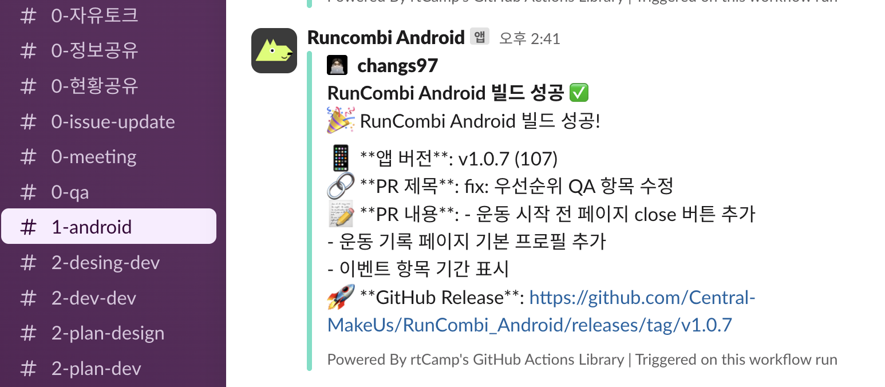

# RunCombi_Android

## 📱 프로젝트 개요

**RunCombi**는 반려동물과 함께하는 운동을 기록하고 관리하는 Android 애플리케이션입니다. 사용자와 반려동물의 운동 데이터를 실시간으로 추적하고, 건강한 라이프스타일을 지원합니다.

### 주요 기능
- 🚶‍♂️ 실시간 운동 추적 (걷기, 뛰기)
- 🐕 반려동물과 함께하는 운동 기록
- 📊 운동 통계 및 칼로리 계산
- 🗺️ GPS 기반 경로 추적
- 🔄 백그라운드 운동 기록 (ForegroundService)
- 👥 사용자 프로필 및 반려동물 관리

## 🏗️ 프로젝트 아키텍처

### Clean Architecture + MVVM 패턴

```
┌─────────────────────────────────────────────────────────────┐
│                        Presentation Layer                    │
│  ┌─────────────┐  ┌─────────────┐  ┌─────────────┐        │
│  │   Screens   │  │ ViewModels  │  │   Composables│        │
│  └─────────────┘  └─────────────┘  └─────────────┘        │
└─────────────────────────────────────────────────────────────┘
                              │
┌─────────────────────────────────────────────────────────────┐
│                         Domain Layer                        │
│  ┌─────────────┐  ┌─────────────┐  ┌─────────────┐        │
│  │   UseCases  │  │   Entities  │  │  Repositories│        │
│  └─────────────┘  └─────────────┘  └─────────────┘        │
└─────────────────────────────────────────────────────────────┘
                              │
┌─────────────────────────────────────────────────────────────┐
│                         Data Layer                          │
│  ┌─────────────┐  ┌─────────────┐  ┌─────────────┐        │
│  │ Repositories│  │ DataSources │  │     Models  │        │
│  └─────────────┘  └─────────────┘  └─────────────┘        │
└─────────────────────────────────────────────────────────────┘
```

### 아키텍처 특징
- **Clean Architecture**: 관심사 분리와 의존성 역전 원칙 적용
- **MVVM**: ViewModel과 StateFlow를 통한 반응형 UI
- **Repository Pattern**: 데이터 접근 추상화
- **UseCase Pattern**: 비즈니스 로직 캡슐화
- **Dependency Injection**: Hilt를 통한 의존성 관리

## 📁 프로젝트 모듈 트리

```
RunCombi_Android/
├── app/                                    # 메인 애플리케이션 모듈
│   ├── src/main/
│   │   ├── java/com/combo/runcombi/
│   │   │   ├── Application.kt             # 애플리케이션 클래스
│   │   │   └── service/                   # ForegroundService
│   │   │       ├── WalkTrackingService.kt
│   │   │       ├── WalkTrackingServiceHelper.kt
│   │   │       └── WalkTrackingDataManager.kt
│   │   └── AndroidManifest.xml
│   └── build.gradle.kts
├── build-logic/                           # 빌드 로직 모듈
│   └── src/main/java/
│       └── runcombi.android.*.gradle.kts  # 커스텀 플러그인
├── core/                                  # 핵심 공통 모듈
│   ├── analytics/                         # 분석 도구
│   ├── data/                              # 데이터 계층
│   │   ├── auth/                          # 인증 데이터
│   │   ├── common/                        # 공통 데이터
│   │   ├── history/                       # 히스토리 데이터
│   │   ├── setting/                       # 설정 데이터
│   │   ├── user/                          # 사용자 데이터
│   │   ├── walk/                          # 운동 데이터
│   │   ├── datastore/                     # 로컬 데이터 저장소
│   │   └── network/                       # 네트워크 통신
│   ├── designsystem/                      # 디자인 시스템
│   ├── domain/                            # 도메인 계층
│   │   ├── auth/                          # 인증 도메인
│   │   ├── common/                        # 공통 도메인
│   │   ├── history/                       # 히스토리 도메인
│   │   ├── setting/                       # 설정 도메인
│   │   ├── user/                          # 사용자 도메인
│   │   └── walk/                          # 운동 도메인
│   ├── navigation/                        # 네비게이션
│   └── ui/                                # 공통 UI 컴포넌트
└── feature/                               # 기능별 모듈
    ├── history/                           # 운동 히스토리
    ├── login/                             # 로그인/인증
    ├── main/                              # 메인 화면
    ├── setting/                           # 설정
    ├── signup/                            # 회원가입
    └── walk/                              # 운동 추적
```

## 🔧 프로젝트 모듈별 설명

### 📱 App Module
- **역할**: 메인 애플리케이션 진입점
- **주요 구성**: Application 클래스, ForegroundService, AndroidManifest
- **특징**: 모든 모듈을 통합하고 의존성 주입 설정

### 🏗️ Build-Logic Module
- **역할**: 커스텀 Gradle 플러그인 및 빌드 로직
- **주요 구성**: 
  - `runcombi.android.application.gradle.kts`
  - `runcombi.android.compose.gradle.kts`
  - `runcombi.android.feature.gradle.kts`
  - `runcombi.android.library.gradle.kts`

### 🎯 Core Module
#### Analytics
- **역할**: 사용자 행동 분석 및 이벤트 추적
- **기술**: Firebase Analytics, 커스텀 이벤트 로깅

#### Data Layer
- **역할**: 데이터 접근 및 관리
- **구성**:
  - **Auth**: 사용자 인증 및 권한 관리
  - **Common**: 공통 데이터 모델 및 유틸리티
  - **History**: 운동 기록 데이터 관리
  - **Setting**: 사용자 설정 데이터
  - **User**: 사용자 프로필 및 정보
  - **Walk**: 운동 추적 데이터
  - **Datastore**: 로컬 데이터 저장 (Proto DataStore)
  - **Network**: API 통신 및 네트워크 처리

#### Domain Layer
- **역할**: 비즈니스 로직 및 엔티티 정의
- **구성**: 각 데이터 모듈에 대응하는 도메인 모듈
- **특징**: UseCase 패턴으로 비즈니스 로직 캡슐화

#### Design System
- **역할**: 일관된 UI/UX 컴포넌트 제공
- **구성**: 테마, 색상, 타이포그래피, 공통 컴포넌트

#### Navigation
- **역할**: 화면 간 네비게이션 관리
- **기술**: Jetpack Navigation Compose

#### UI
- **역할**: 공통 UI 컴포넌트 및 유틸리티
- **구성**: 재사용 가능한 Compose 컴포넌트

### ⚡ Feature Modules
#### History
- **역할**: 운동 기록 조회 및 통계
- **기능**: 운동 히스토리, 통계 차트, 필터링

#### Login
- **역할**: 사용자 인증 및 로그인
- **기능**: 카카오 로그인, 자동 로그인

#### Main
- **역할**: 메인 화면 및 네비게이션
- **기능**: 하단 네비게이션, 홈 화면

#### Setting
- **역할**: 사용자 설정 및 프로필 관리
- **기능**: 개인정보 수정, 알림 설정

#### Signup
- **역할**: 회원가입 및 초기 설정
- **기능**: 사용자 정보 입력, 반려동물 등록

#### Walk
- **역할**: 운동 추적 및 기록
- **기능**: GPS 추적, 실시간 기록, ForegroundService 연동

## 🛠️ 프로젝트 기술 스택

### 📱 Android & Kotlin
- **언어**: Kotlin 100%
- **최소 SDK**: API 26 (Android 8.0)
- **타겟 SDK**: API 35 (Android 15)
- **Jetpack Compose**: UI 프레임워크

### 🏗️ 아키텍처 & 패턴
- **Clean Architecture**: 계층별 관심사 분리
- **MVVM**: Model-View-ViewModel 패턴
- **Repository Pattern**: 데이터 접근 추상화
- **UseCase Pattern**: 비즈니스 로직 캡슐화

### 🔧 주요 라이브러리
- **의존성 주입**: Hilt
- **비동기 처리**: Kotlin Coroutines + Flow
- **네비게이션**: Jetpack Navigation Compose
- **상태 관리**: StateFlow, MutableStateFlow
- **데이터 저장**: Proto DataStore, Room
- **네트워크**: Retrofit, OkHttp
- **이미지 처리**: Coil
- **권한 관리**: Accompanist Permissions

### 📊 외부 서비스
- **분석**: Firebase Analytics
- **크래시 리포팅**: Firebase Crashlytics
- **지도**: Google Maps API
- **소셜 로그인**: Kakao SDK

### 🚀 빌드 도구
- **빌드 시스템**: Gradle (Kotlin DSL)
- **모듈화**: Feature-based 모듈 구조
- **커스텀 플러그인**: 자체 Gradle 플러그인

## 🏭 Flavor 시스템

### Product Flavors
프로젝트는 개발 환경과 프로덕션 환경을 분리하기 위해 두 가지 flavor를 제공합니다.

#### 🧪 Mock Flavor
- **목적**: 개발 및 테스트 환경
- **특징**:
  - 가짜 데이터(Mock Data) 사용
  - 네트워크 API 호출 없이 로컬에서 테스트
  - 빠른 개발 및 디버깅
  - 테스트 데이터로 UI 검증

#### 🚀 Prod Flavor
- **목적**: 실제 프로덕션 환경
- **특징**:
  - 실제 서버 API 연동
  - Firebase 서비스 연동
  - Google Maps API 연동
  - 실제 사용자 데이터 처리


### Flavor별 설정 파일
```
app/
├── src/
│   ├── mock/                    # Mock flavor 전용 소스
│   │   ├── java/
│   │   │   └── com/combo/runcombi/
│   │   │       └── mock/        # Mock 데이터 구현
│   │   └── res/
│   ├── prod/                    # Prod flavor 전용 소스
│   │   ├── java/
│   │   │   └── com/combo/runcombi/
│   │   │       └── prod/        # 실제 서비스 구현
│   │   └── res/
│   └── main/                    # 공통 소스
```


### Flavor 활용 시나리오

#### 🧪 개발 단계 (Mock)
- UI 개발 및 테스트
- 비즈니스 로직 검증
- 네트워크 없이 빠른 반복 개발
- 테스트 데이터로 다양한 시나리오 검증

#### 🚀 배포 단계 (Prod)
- 실제 서버와의 연동 테스트
- 성능 및 안정성 검증
- 실제 사용자 시나리오 테스트
- 스토어 배포용 빌드

## 🔄 CI/CD 파이프라인 흐름

### 📱 Slack 빌드 알림 예시


### 🔄 QA 중심 CI/CD 파이프라인 흐름

```
1. 개발자 코드 Push/PR 생성
   ↓
2. GitHub Actions 자동 트리거
   ↓
3. 자동 빌드 실행
   ↓
4. 빌드 성공 시:
   ├── Firebase Distribution 자동 업로드
   ├── Slack #1-android 채널로 알림 전송
   └── GitHub Release 자동 생성
   ↓
5. QA 팀 및 테스터에게 자동 배포
   ├── Firebase 콘솔에서 APK 다운로드
   ├── 테스트 환경에서 기능 검증
   └── 피드백 수집 및 이슈 등록
   ↓
6. QA 피드백 반영 및 재배포
   ├── 이슈 수정 및 코드 개선
   ├── 재빌드 및 재배포
   └── 최종 QA 승인
   ↓
7. 스토어 배포 준비 완료
```

## 🎨 뷰모델 및 UI 로직 패턴

### 📱 ViewModel 패턴

#### 기본 구조
```kotlin
@HiltViewModel
class ExampleViewModel @Inject constructor(
    private val useCase: ExampleUseCase,
    private val repository: ExampleRepository
) : ViewModel() {
    
    private val _uiState = MutableStateFlow(ExampleUiState())
    val uiState: StateFlow<ExampleUiState> = _uiState.asStateFlow()
    
    private val _eventFlow = MutableSharedFlow<ExampleEvent>()
    val eventFlow: SharedFlow<ExampleEvent> = _eventFlow.asSharedFlow()
    
    fun handleAction(action: ExampleAction) {
        viewModelScope.launch {
            when (action) {
                is ExampleAction.Load -> loadData()
                is ExampleAction.Submit -> submitData(action.data)
            }
        }
    }
    
    private suspend fun loadData() {
        _uiState.update { it.copy(isLoading = true) }
        
        try {
            val result = useCase.execute()
            _uiState.update { 
                it.copy(
                    data = result,
                    isLoading = false
                )
            }
        } catch (e: Exception) {
            _uiState.update { 
                it.copy(
                    error = e.message,
                    isLoading = false
                )
            }
        }
    }
}
```

#### UI 상태 관리
```kotlin
data class ExampleUiState(
    val data: List<ExampleData> = emptyList(),
    val isLoading: Boolean = false,
    val error: String? = null,
    val selectedItem: ExampleData? = null
)

sealed class ExampleEvent {
    object NavigateToDetail : ExampleEvent()
    object ShowError : ExampleEvent()
    data class ShowToast(val message: String) : ExampleEvent()
}
```

### 🎨 Compose UI 패턴

#### 화면 구조
```kotlin
@Composable
fun ExampleScreen(
    onNavigate: (String) -> Unit,
    viewModel: ExampleViewModel = hiltViewModel()
) {
    val uiState by viewModel.uiState.collectAsStateWithLifecycle()
    
    LaunchedEffect(Unit) {
        viewModel.handleAction(ExampleAction.Load)
    }
    
    LaunchedEffect(Unit) {
        viewModel.eventFlow.collectLatest { event ->
            when (event) {
                is ExampleEvent.NavigateToDetail -> onNavigate("detail")
                is ExampleEvent.ShowError -> { /* 에러 처리 */ }
                is ExampleEvent.ShowToast -> { /* 토스트 표시 */ }
            }
        }
    }
    
    ExampleContent(
        uiState = uiState,
        onAction = viewModel::handleAction
    )
}
```

#### 컴포넌트 구조
```kotlin
@Composable
fun ExampleContent(
    uiState: ExampleUiState,
    onAction: (ExampleAction) -> Unit
) {
    Column(
        modifier = Modifier.fillMaxSize(),
        horizontalAlignment = Alignment.CenterHorizontally
    ) {
        when {
            uiState.isLoading -> LoadingIndicator()
            uiState.error != null -> ErrorContent(
                error = uiState.error!!,
                onRetry = { onAction(ExampleAction.Load) }
            )
            else -> DataContent(
                data = uiState.data,
                onItemClick = { item ->
                    onAction(ExampleAction.SelectItem(item))
                }
            )
        }
    }
}
```
